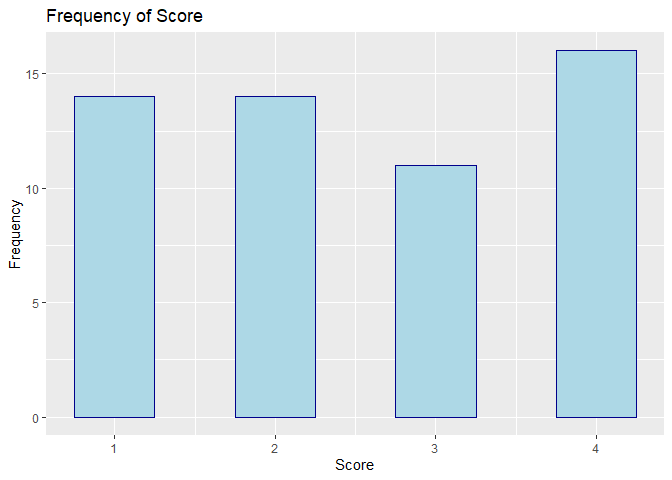

Date: 2021-01-25

## About

In this notebook, we

-   load the `tidyverse` using `library()`
-   load a `csv` file into a `data.frame` using `read.csv()`
-   preview a `data.frame` using `head()`
-   display a simple bar plot using `ggplot` and `geom_bar`

``` r
library(tidyverse)
```

    ## -- Attaching packages --------------------------------------- tidyverse 1.3.0 --

    ## v ggplot2 3.3.3     v purrr   0.3.4
    ## v tibble  3.0.5     v dplyr   1.0.3
    ## v tidyr   1.1.2     v stringr 1.4.0
    ## v readr   1.4.0     v forcats 0.5.0

    ## -- Conflicts ------------------------------------------ tidyverse_conflicts() --
    ## x dplyr::filter() masks stats::filter()
    ## x dplyr::lag()    masks stats::lag()

## Working with raw data

Load the data with `read.csv`

``` r
x <- read.csv("../data/tattoos.csv"); head(x)
```

    ##   Method Gender  Size Depth Score
    ## 1      A      m large  deep     1
    ## 2      A      m large   mod     1
    ## 3      B      f small  deep     1
    ## 4      B      m small   mod     4
    ## 5      B      f large  deep     3
    ## 6      B      m   med   mod     4

We can see that the data is currently in its raw form. That is, the
scores have not already been aggregated. When this is the case, we would
`geom_bar()` to plot the `Score` column.

``` r
ggplot(data = x) + 
  geom_bar(
    mapping = aes(x = Score),  # column to plot
    color = "darkblue",  # border colour
    fill = "lightblue",  # fill colour
    width = 0.5) +  # width of each bar
  labs(
    title = "Frequency of Score",  # title of the plot
    x = "Score",  # x-axis label
    y = "Frequency")  # y-axis label
```

<!-- -->

## Working with summarised data

``` r
y <- read.csv("../data/workforce.csv"); head(y)
```

    ##    Occupation.type  Male Female Total
    ## 1         Managers 2.118  1.153 3.271
    ## 2     Professional 3.172  3.014 6.186
    ## 3        Technical 2.466  1.901 4.367
    ## 4   Administrative 0.860  2.480 3.340
    ## 5   Skilled trades 3.107  0.334 3.441
    ## 6 Caring & leisure 0.520  2.390 2.910

The data could already be summarised, as it is in this case. Here we
would instead use `geom_col` to display the actual data values to plot
`Occupation.type` against `Total`.

Note that the `theme()` function is used to adjust how the categorical
labels appear on the x-axis.

``` r
ggplot(data = y) +
  geom_col(
    mapping = aes(x = Occupation.type, y = Total),
    color = "darkblue",
    fill = "lightblue") +
  labs(
    title = "Total UK Workforce by Occupation Type",  # title of the plot
    x = "",  # Suppress the x-axis label
    y = "Frequency (millions)") +  # y-axis label
  theme(
    axis.text.x = element_text(angle = 45, hjust = 1))
```

<!-- -->

Note that `R` sorts categorical data alphabetically. We can change the
order of the categories by using the `reorder()` function.

``` r
ggplot(data = y) +
  geom_col(
    mapping = aes(x = reorder(Occupation.type, -Total), y = Total),
    color = "darkblue",
    fill = "lightblue") +
  labs(
    title = "Total UK Workforce by Occupation Type",  # title of the plot
    x = "",  # Suppress the x-axis label
    y = "Frequency (millions)") +  # y-axis label
  theme(
    axis.text.x = element_text(angle = 45, hjust = 1))
```

<!-- -->

## References

-   Activities 4, 5, 6 **(M248 Computer Book A)**
-   [Data
    visualisation](https://r4ds.had.co.nz/data-visualisation.html#statistical-transformations)
    **(R for Data Science)**
-   [Bar charts](https://ggplot2.tidyverse.org/reference/geom_bar.html)
    **(ggplot2)**
-   [Modify axis, legend, and plot
    labels](https://ggplot2.tidyverse.org/reference/labs.html)
    **(ggplot2)**
-   [Reordering a ggplot bar chart
    axis](https://www.rpubs.com/dvdunne/reorder_ggplot_barchart_axis)
    **(RPubs)**
