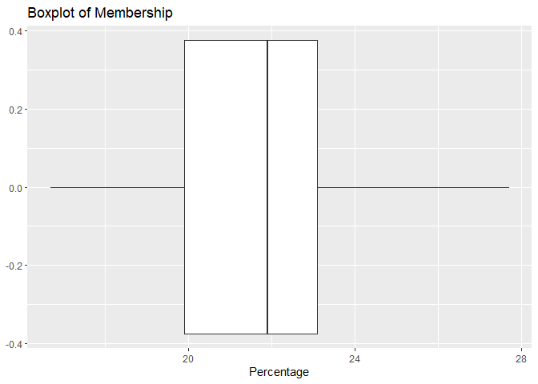
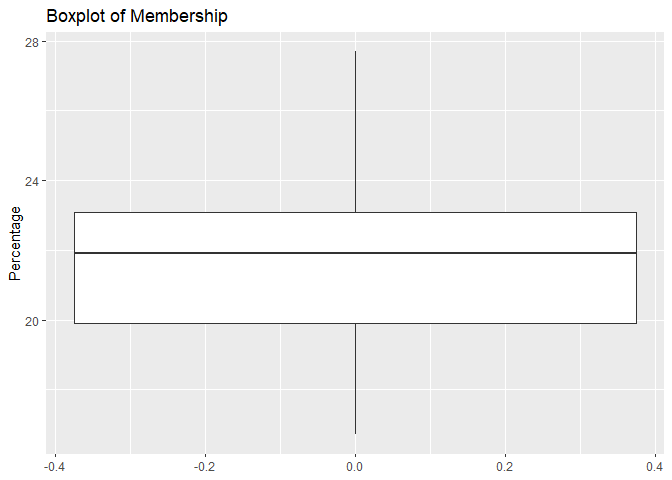

## About

    ## -- Attaching packages --------------------------------------- tidyverse 1.3.0 --

    ## v ggplot2 3.3.3     v purrr   0.3.4
    ## v tibble  3.0.5     v dplyr   1.0.3
    ## v tidyr   1.1.2     v stringr 1.4.0
    ## v readr   1.4.0     v forcats 0.5.0

    ## -- Conflicts ------------------------------------------ tidyverse_conflicts() --
    ## x dplyr::filter() masks stats::filter()
    ## x dplyr::lag()    masks stats::lag()

## Boxplots

Load the data using `read.csv()`.

``` r
# import the data
membership <- read.csv(file = "../data/membership.csv");
head(membership)
```

    ##   Percentage
    ## 1       16.8
    ## 2       21.9
    ## 3       24.0
    ## 4       16.7
    ## 5       24.9
    ## 6       21.3

Plot a boxplot by using `geom_boxplot()` function. Whether the boxplot
is horizontal or vertical depends on what parameter we set in the
mapping parameter.

### Horizontal boxplot

``` r
ggplot(data = membership) +
  geom_boxplot(
    mapping = aes(x = Percentage)) +
  labs(
    title = "Boxplot of Membership"
  )
```

<!-- -->

### Vertical boxplot

Plot a default vertical boxplot by using `geom_boxplot()`, setting
`aes(y)`.

``` r
ggplot(data = membership) +
  geom_boxplot(
    mapping = aes(y = Percentage)) +
  labs(
    title = "Boxplot of Membership")
```

<!-- -->

## References

-   Activities 8, 9 **(M248 Computer Book A)**
-   [A box and whiskers plot (in the style of
    Tukey)](https://ggplot2.tidyverse.org/reference/geom_boxplot.html?q=boxp)
    **(ggplot2 documentation)**
