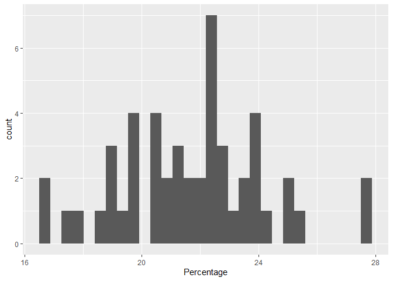
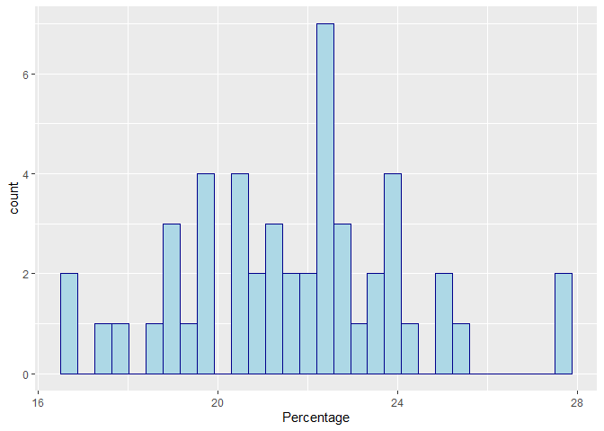
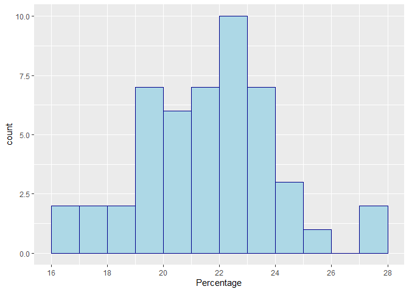
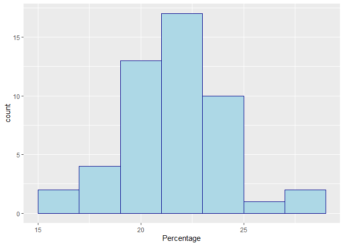

Date: 2021-01-25

## About

## Frequency histograms

(Activity 8)

``` r
# load the tidyverse
library(tidyverse)
```

    ## -- Attaching packages --------------------------------------- tidyverse 1.3.0 --

    ## v ggplot2 3.3.3     v purrr   0.3.4
    ## v tibble  3.0.5     v dplyr   1.0.3
    ## v tidyr   1.1.2     v stringr 1.4.0
    ## v readr   1.4.0     v forcats 0.5.0

    ## -- Conflicts ------------------------------------------ tidyverse_conflicts() --
    ## x dplyr::filter() masks stats::filter()
    ## x dplyr::lag()    masks stats::lag()

``` r
# import the data
membership <- read.csv(file = "../data/membership.csv")
```

``` r
# default histogram with geom_histogram
ggplot(data = membership) +
  geom_histogram(mapping = aes(x = Percentage))
```

    ## `stat_bin()` using `bins = 30`. Pick better value with `binwidth`.

<!-- -->

The histogram is rather bland. We can customise it further using
parameters `color` and `fill`.

``` r
# default histogram with geom_histogram
ggplot(data = membership) +
  geom_histogram(
    mapping = aes(x = Percentage),
    color = "darkblue",
    fill = "lightblue")
```

    ## `stat_bin()` using `bins = 30`. Pick better value with `binwidth`.

<!-- -->

## Changing the bin range

``` r
# histogram with different bin widths
ggplot(data = membership) +
  geom_histogram(
    mapping = aes(x = Percentage),
    color = "darkblue",
    fill = "lightblue",
    boundary = 0,
    binwidth = 1) +
  scale_x_continuous(breaks = seq(16, 30, 2))
```

<!-- -->

## Changing the bin width

``` r
# histogram with different bin widths
ggplot(data = membership) +
  geom_histogram(
    mapping = aes(x = Percentage),
    color = "darkblue",
    fill = "lightblue",
    binwidth = 2)
```

<!-- -->

## Changing the bin range

``` r
# histogram with different bin widths
ggplot(data = membership) +
  geom_histogram(
    mapping = aes(x = Percentage),
    color = "darkblue",
    fill = "lightblue",
    binwidth = 2)
```

<!-- -->
