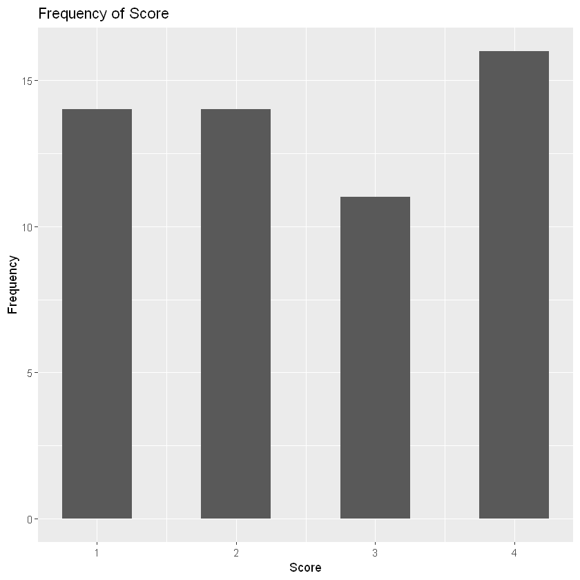

# Bar Charts

Date: 2021-01-25

## About

In this notebook, we

- load the `tidyverse` using `library()`
- load a `csv` file into a `data.frame` using `read.csv()`
- preview a `data.frame` using `head()`
- display a simple bar plot using `ggplot` and `geom_bar`

## Working with raw data

Load the `tidyverse` into the environment.

```R
library(tidyverse)
```

Import the data into the environment.

```R
x <- read.csv("../data/tattoos.csv")
```

Preview the data by just executing the variable `x`.

```R
head(x)
```

<table class="dataframe">
<caption>A data.frame: 6 x 5</caption>
<thead>
	<tr><th></th><th scope=col>Method</th><th scope=col>Gender</th><th scope=col>Size</th><th scope=col>Depth</th><th scope=col>Score</th></tr>
	<tr><th></th><th scope=col>&lt;chr&gt;</th><th scope=col>&lt;chr&gt;</th><th scope=col>&lt;chr&gt;</th><th scope=col>&lt;chr&gt;</th><th scope=col>&lt;int&gt;</th></tr>
</thead>
<tbody>
	<tr><th scope=row>1</th><td>A</td><td>m</td><td>large</td><td>deep</td><td>1</td></tr>
	<tr><th scope=row>2</th><td>A</td><td>m</td><td>large</td><td>mod </td><td>1</td></tr>
	<tr><th scope=row>3</th><td>B</td><td>f</td><td>small</td><td>deep</td><td>1</td></tr>
	<tr><th scope=row>4</th><td>B</td><td>m</td><td>small</td><td>mod </td><td>4</td></tr>
	<tr><th scope=row>5</th><td>B</td><td>f</td><td>large</td><td>deep</td><td>3</td></tr>
	<tr><th scope=row>6</th><td>B</td><td>m</td><td>med  </td><td>mod </td><td>4</td></tr>
</tbody>
</table>

The data we wish to plot, `Score`, has come through as an `int`, so there is no more work needed on the data.

Plot the `Score` attribute using `ggplot + geom_bar`.

```R
ggplot(data = x) + 
  geom_bar(mapping = aes(x = Score))
```


## Working with summarised data

The data here was in its raw form, so we used the default `geom_bar`, which by default uses `stat=count`.
However, the data could already be summarised.
When this is the case we would instead use `geom_col` to display the actual data values in the column.

```R
y <- read.csv("../data/workforce.csv")
```

```R
head(y)
```

<table class="dataframe">
<caption>A data.frame: 6 x 4</caption>
<thead>
	<tr><th></th><th scope=col>Occupation.type</th><th scope=col>Male</th><th scope=col>Female</th><th scope=col>Total</th></tr>
	<tr><th></th><th scope=col>&lt;chr&gt;</th><th scope=col>&lt;dbl&gt;</th><th scope=col>&lt;dbl&gt;</th><th scope=col>&lt;dbl&gt;</th></tr>
</thead>
<tbody>
	<tr><th scope=row>1</th><td>Managers        </td><td>2.118</td><td>1.153</td><td>3.271</td></tr>
	<tr><th scope=row>2</th><td>Professional    </td><td>3.172</td><td>3.014</td><td>6.186</td></tr>
	<tr><th scope=row>3</th><td>Technical       </td><td>2.466</td><td>1.901</td><td>4.367</td></tr>
	<tr><th scope=row>4</th><td>Administrative  </td><td>0.860</td><td>2.480</td><td>3.340</td></tr>
	<tr><th scope=row>5</th><td>Skilled trades  </td><td>3.107</td><td>0.334</td><td>3.441</td></tr>
	<tr><th scope=row>6</th><td>Caring &amp; leisure</td><td>0.520</td><td>2.390</td><td>2.910</td></tr>
</tbody>
</table>

Plot `Occupation.type` against `Total`.

```R
ggplot(data = y) +
  geom_col(mapping = aes(x = Occupation.type, y = Total)) +
  labs(x = "Occupation type", y = "Frequency (millions)", title = "Total UK workforce")
```


## Customising a bar chart

### Changing the color of the bars

Change the color of the bars by using the `color=` and `fill=` parameters.

```R
ggplot(data = x) + 
  geom_bar(mapping = aes(x = Score), color = 'darkblue', fill = 'lightblue')
```


### Altering the widths of the bars

Alter the width of the bars by using the `width=` parameter.

```R
ggplot(data = x) + 
  geom_bar(mapping = aes(x = Score), width = 0.5)
```


### Renaming the axes

Rename the $y-$axis to **Frequency** by using `labs(y)`.
Note that to rename the $x-$axis you would use `labs(x)`.

```R
ggplot(data = x) + 
  geom_bar(mapping = aes(x = Score), width = 0.5) +
  labs(y = "Frequency")
```


### Adding a title

Add a title to the chart using `labs(title)`.

```R
ggplot(data = x) + 
  geom_bar(mapping = aes(x = Score), width = 0.5) +
  labs(y = "Frequency", title = "Frequency of Score")
```



### Reordering the columns

The default `geom_col` output shows the categorical data in alphabetical order.
We can change the order by modifying `aes(x)` to include the `reorder` function.

```R
ggplot(data = y) +
  geom_col(mapping = aes(x = reorder(Occupation.type, -Total), y = Total)) +
  labs(x = "Occupation type", y = "Frequency (millions)", title = "Total UK workforce")
```


## References

- Activities 4, 5, 6 **(M248 Computer Book A)**
- [Data visualisation](https://r4ds.had.co.nz/data-visualisation.html#statistical-transformations) **(R for Data Science)**
- [Modify axis, legend, and plot labels](https://ggplot2.tidyverse.org/reference/labs.html) **(ggplot2 documentation)**
- [Reordering a ggplot bar chart axis](https://www.rpubs.com/dvdunne/reorder_ggplot_barchart_axis) **(RPubs)**

## Tags

#geom_bar
#geom_col
#ggplot
#head #labs
#read
#reorder
#tidyverse
